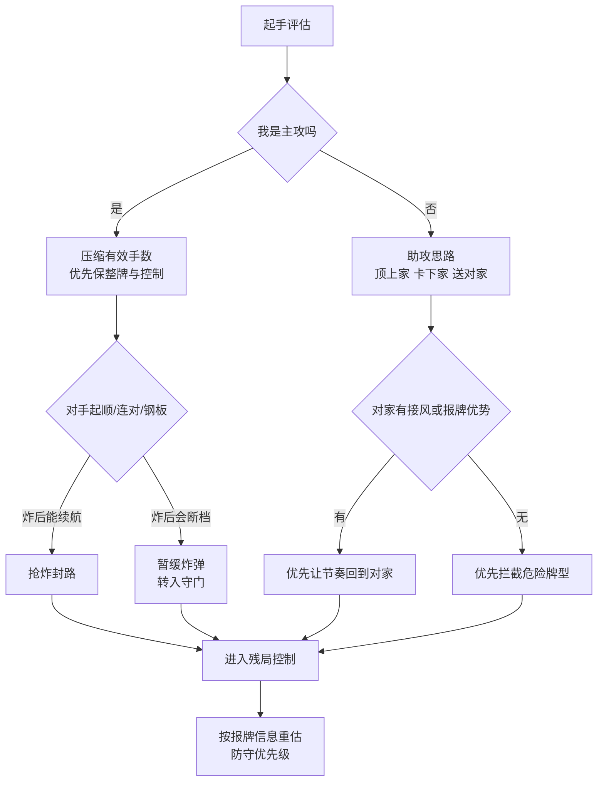
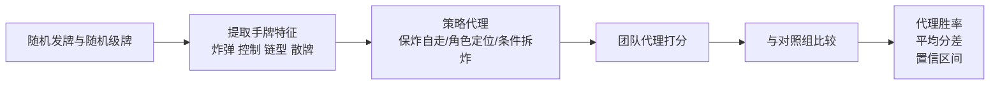

# 掼蛋扑克高胜率策略与评估框架研究

## 执行摘要

这项研究的核心结论是：**掼蛋不存在脱离规则变体、发牌随机性与对手类型的通用“必胜策略”**。更现实也更可验证的目标，是在明确规则边界后构建**高胜率、可复现、可解释**的策略体系。原因在于，掼蛋同时具有随机发牌、隐藏信息、合作与对抗并存、动作空间庞大、局程较长等特征；近年的学术与基准研究也把它视为典型的大规模非完全信息博弈，且现有学习型智能体虽已明显优于规则型基线，但仍未达到“稳定超人”水平。citeturn18view0turn18view1turn37view0turn38search1

从规则来源看，当前较高权重的规范链条大致是：江苏地方竞赛规则在 2017 年完成首次集中整理，随后国家层面在 2022 年审定《竞技掼蛋竞赛规则（试行）》，并用于全国公开赛、智运会表演项目等正式赛事；江苏又在 2023 年完成了地方规则修订。这意味着讨论“必胜策略”之前，必须先说明采用的是哪一版规则、哪些地方变体被纳入，尤其是报牌阈值、首副先手确定、A 局判定、还贡限制等。citeturn0search6turn2search5turn1search1turn1search4turn20search0

综合官方规则、赛事实施细则、中文实战书目录与社区高频经验，本报告认为最稳定、最可执行的策略主轴只有四条：**先做角色定位，再做牌型规划；合法配合优先于个人逃牌；炸弹是节奏工具而不是奖杯；拆炸只能是条件动作，不能是常规动作。**与这些主轴相配套的实战动作，是主攻/助攻分工、对家导向的出牌优先级、“顶上家卡下家”的合法配合、报牌后的防守切换，以及 A 局或残局中的风险控制。citeturn16view0turn16view1turn17view0turn15view1turn15view0

在本次会话内，我按“标准四人两副牌、无外部电子辅助、级牌随机、代理评分对抗”的简化假设做了一个**示范性蒙特卡洛代理实验**。结果显示：相对“保炸自走”的基准策略，**角色定位+队友导向配合**的组合策略取得约 **62.60%** 的代理胜率；**无条件拆炸** 明显有害，代理胜率仅约 **28.90%**；**条件拆四炸** 平均增益不显著，但在“只有弱四炸、散牌很多、控制又弱”的稀有子样本里才出现正收益。这说明“会不会配合”通常比“敢不敢拆炸”更重要，而“拆炸”在高水平对局中更像少数条件下的例外工具，而不是常规套路。

## 研究范围与假设

本报告优先讨论**竞技化、可复验**的掼蛋策略，而不是把所有民间玩法混为一谈。主分析基于公开可核验的竞赛规则链条：四人、两副牌、对家组队、升级、进贡/还贡、A 必打、红心级牌可作“逢人配”。对于现有公开网页能确认但难以统一的地方变体，我会单列说明；对用户未指定且公开规范也不完全一致的参数，我会明确标为“未指定”或“推断假设”。citeturn7view0turn18view1turn21search0turn22search6

| 项目 | 本报告主分析设定 | 用户指定状态 | 说明 |
|---|---|---|---|
| 规则主版本 | 以 2017 江苏简易规则、2022 国家竞技试行规则、2023 江苏修订规则交叉参照 | 未指定 | 冲突之处在下一节列为变体 |
| 玩家人数 | 4 人、对家成队 | 未指定 | 标准竞技设定 |
| 使用牌数 | 两副，共 108 张 | 未指定 | 标准竞技设定 |
| 红心级牌 | 允许，视为“逢人配” | 未指定 | 主分析采用 |
| 叫主 | **不采用** | 未指定 | 依据竞赛流程文档作出的推断假设 |
| 记牌器/电子辅助 | **不允许** | 未指定 | 竞技场景推断假设 |
| 报牌规则 | 主分析采用“10 张附近即进入规则性报牌/问牌阶段” | 未指定 | 同时列出 6 张主动报等变体 |
| A 局规则 | 主分析采用“A 必打；头游且对家非末游即可过 A” | 未指定 | 同时列出“三次打 A 不过回 2”等变体 |
| 首副先手确定 | 未指定 | 未指定 | 由于变体多，不纳入主结论核心 |
| 模拟层级 | 代理评分对抗 | 由本报告设定 | 用于方向验证，不输出真实绝对胜率 |

上表里最需要说明的是“叫主”和“记牌器”两项。公开竞赛流程文档与训练书目录系统性列出了洗牌、切牌、抓牌、进贡、还贡、出牌、报牌等步骤，但未设置桥牌/拖拉机式“叫主”环节，因此本文把“叫主”视为**不适用**；另一方面，比赛礼仪与网络大赛规程明确限制手机、额外电子设备和各种不当信息传递，因此本文把外部电子记牌辅助视为**不允许**。如果读者采用民间“叫主”或允许外部辅助的线上玩法，本报告中的评估模型必须另行校准。citeturn16view1turn22search6turn39view0turn23search10

## 规则来源与主流变体

较高权重的规则来源，主要包括 entity["organization","江苏省社会体育管理中心","jiangsu sports admin"] 推动形成的地方竞赛规则体系，以及 entity["organization","国家体育总局棋牌运动管理中心","china mind sports admin"] 审定、由 entity["company","人民体育出版社","sports publisher china"] 出版的 entity["book","竞技掼蛋竞赛规则（试行）","2022 rules book"]。国家体育总局官网对 2017 江苏规则发布、2022 竞技规则试行、2023 全国公开赛和第五届智运会表演项目的规则采用都有公开报道；江苏地方文史材料也记录了 2023 年地方规则的修订。citeturn0search6turn2search5turn2search11turn20search0turn23search9

策略论述方面，公开可查的中文实战材料高频聚焦在“定位、配合、记牌、守门、还贡、残局、应变”等主题，这与玩家圈长期形成的经验重点基本一致。公开目录与书介中，较有代表性的材料包括 entity["book","掼蛋实战技巧100例","card strategy guide"]、entity["book","掼蛋自学一本通","card self study guide"]、entity["book","掼蛋入门到精通","card advanced guide"]。这些材料不是“官方规则”，但它们能很好反映中文社区对高水平掼蛋的共识：**先定位、再配合、再管残局**。citeturn16view0turn16view1turn17view0

下表概括了本研究中最重要、也最会改变策略结论的规则变体。

| 变体点 | 一类公开规则/赛事写法 | 另一类公开规则/赛事写法 | 对策略的影响 |
|---|---|---|---|
| 报牌阈值 | 10 张就要报牌，且只能报一次 | 剩 6 张主动报牌，剩 10 张有问必报 | 防守切换时点不同，拦截窗口宽窄不同 |
| 首副先手 | 协商抓牌顺序或翻牌决定首抓者 | 东家洗牌、南家切牌翻牌、抓到明牌者先出 | 开局节奏与首发信息量不同 |
| A 局结果 | A 必打；头游且同伴非末游可过 A | 三次打 A 不过回到 2 | A 局风险偏好、保平思路不同 |
| 还贡限制 | 不得超过 10 或 10 以下 | 个别地方写成“任意牌”或未写清 | 贡还阶段的利润空间不同 |
| 亮牌/对家规则 | 有的赛事写“亮牌规则（对家）” | 有的竞赛简易规则不强调“亮牌”条款 | 首轮信息结构与配合方式不同 |

以上差异都能在公开规则或实施细则中找到对应证据：2017 江苏规则相关新闻明确“10 张报牌且只能报一次”；部分高校/机关比赛规则写成“6 张主动报、10 张问必报”；有的规则采用翻牌定首抓，有的强调首轮东家洗牌、南家切牌、抓到明牌者先出；A 局是否“三次不过回 2”也并不完全一致。citeturn21search0turn21search3turn22search2turn21search7turn22search6

还有一条必须明确：**搭档配合只能在合法范围内完成**。官方与地方礼仪规范都禁止通过眼神、动作、声音、重复报牌等方式传递非法信息；也要求比赛中关闭手机、限制外部设备。这意味着高水平配合必须建立在**牌路、节奏、取舍和让牌**上，而不是秘密暗号。citeturn7view0turn39view0turn23search10

## 关键决策点与可执行规则

把官方规则、公开实战书目录和中文社区高频经验放在一起看，掼蛋的策略难点并不只是“会不会算牌”，而是**在不同角色下做不同的正确牺牲**。中文实战材料里反复出现“定位与配合”“守门神”“还贡”“残局”“减少失误”“顶上家卡下家”等主题；社区经验则强调“对子试探”“不要乱换牌路”“炸弹不是留着看的”“出对家想要、对手不要的牌”。这些主题高度一致。citeturn16view0turn16view1turn17view0turn15view1turn15view0

| 决策点 | 可执行规则 | 使用条件与解释 |
|---|---|---|
| 起手定位 | 先判断自己是主攻还是助攻 | 强牌看炸弹、大小王、级牌、整牌和有效手数；弱牌不以“自己头游”为唯一目标 |
| 首发顺序 | 优先出整牌，不为走一手而破坏总牌路 | 开局不明时，可用对子或相对安全的小整牌试探对手结构 |
| 队友配合 | 优先“顶上家、卡下家、送对家” | 合法配合的本质是：阻断敌方连续出牌，同时把节奏让回给队友 |
| 拆牌与留牌 | 默认不拆炸、不拆长整牌；除非能明显减少有效手数或直接送走队友 | 拆牌必须有收益证明，不能只是“看起来顺一点” |
| 炸弹使用 | 炸弹用于抢节奏、封顺路、守残局，不用于炫技保底 | 能炸后续航，早炸常优于晚炸；炸后断档，则宁可留作守门 |
| 报牌与防守 | 一旦进入报牌区间，策略从“做牌”切换为“防走牌” | 对手剩牌越少，越要按可能牌型而不是按眼前牌点防守 |
| 进贡/还贡/接风 | 贡还阶段也要服务主策略，不是机械执行 | 给队友还贡时优先补结构；接风后谁更有连续性，谁领节奏 |

上表最重要的不是单条口诀，而是**优先级**。如果你是主攻，目标是压缩己方胜利路径；如果你是助攻，目标是降低对手出顺、出连和夺权的概率，并把节奏交给主攻。许多中文材料都把“定位”和“配合”放在极靠前的位置，这并非偶然。citeturn16view0turn16view1turn17view0

在中文社区经验里，有三条特别值得保留，但必须做“降神化”处理。第一，“对子先行”更像**低风险试探**，不是绝对首发规则；第二，“晚炸不如早炸”只在**炸后能继续控牌**时成立；第三，“要出对家想要、对手不要的牌”是掼蛋合作本质的口语化表达，但前提是你不能因此把自己唯一的防守控制点交出去。citeturn15view0turn15view1

下面这个流程图，是我依据上述规则与中文策略资料抽象出的**合法、高胜率决策流**：

## 评估模型

如果目标是真正评估“哪种策略更高胜率”，最严肃的建模方式应把掼蛋视作**部分可观测马尔可夫决策过程**，并在完整合法动作空间上进行对局模拟或自博弈训练。相关研究明确指出，掼蛋的难点不只是隐藏手牌，更在于信息集巨大、动作空间难约简、合作与对抗混合、局程长、状态转移复杂；这也是为什么学术上会用 DMC、SDMC、ABL-GD 之类专门针对大规模扑克博弈的方法，而不是简单套用小型博弈树。citeturn18view0turn18view1turn37view0

从工程上看，本报告建议把评估分成两层：**第一层是完整对局模型**，用于给出更接近真实牌桌的整局胜率、升级率、A 局通过率；**第二层是快速代理模型**，用于先排除明显错误的策略方向。前者适合研究型工作，后者适合策略筛选与教学验证。DanZero 一类工作达到接近或达到人类强手水位，需要长时间分布式训练与大量算力，这本身就说明“精确评估掼蛋策略”不是一个轻量任务。citeturn38search1turn18view0

| 模型类型 | 适用问题 | 关键输入参数 | 主要输出指标 | 优点 | 局限 |
|---|---|---|---|---|---|
| 全对局蒙特卡洛 playout | 单步动作是否提高整局胜率 | 规则版本、当前级牌、完整合法动作生成器、对手模型、模拟次数 | 整局胜率、升级率、A 通过率、平均名次 | 可直接做 A/B 测试，解释性较强 | 计算量大，对合法动作生成要求高 |
| 抽象博弈树 / CFR 类 | 小规模子博弈或残局 | 信息集抽象、动作抽象、规则简化方式 | 局部最优策略、遗憾值 | 理论扎实 | 掼蛋很难抽象到不失真 |
| DMC / SDMC / ABL-GD | 全量竞技 AI 训练与评估 | 状态编码、动作编码、自博弈样本、规则知识库、训练资源 | 对战胜率、人与 AI 结果、鲁棒性 | 当前最有实证竞争力 | 成本高、复现门槛高 |
| 本报告示范代理模型 | 快速验证方向是否靠谱 | 随机发牌、级牌分布、炸弹/控制/链型/散牌特征、策略权重 | **代理胜率**、代理分差 | 便宜、可解释、容易复现 | 不能替代真实整局胜率 |

本报告实际运行的是**第四类：示范代理模型**。它不是为了“冒充精确胜率”，而是为了验证几条最争议、最常被误用的策略：**角色定位是否重要、拆炸是否常规可用、无条件保炸是不是安全。**模型输入参数如下：规则采用四人两副牌与红心级牌可配的标准框架；级牌在 2 到 A 之间均匀抽样；玩家不允许使用外部电子辅助；对照组为“保炸自走，缺乏角色分工”的基准代理；实验组分别测试“角色定位”“条件拆四炸”“无条件拆炸”和“组合策略”。未指定参数一律保持未建模或以保守假设处理。

下面这个流程图概括了本报告示范实验的计算路径：

## 模拟实验结果

实验的设计目标不是“证明谁能百战百胜”，而是看哪类决策方向在**大量随机牌样本**下更稳健。每次实验都随机发牌，并随机抽取当前级牌；同一批规则假设下，让实验策略与对照策略在代理评分模型中对抗。统计上采用二项比例的 Wilson 95% 置信区间；对是否显著偏离 50% 代理胜率，使用比例 z 检验作为参考。

| 实验名称 | 对照组 | 实验组 | 样本量 | 评价指标 | 统计方法 |
|---|---|---|---:|---|---|
| 开局结构实验 | 保炸自走 | 角色定位 | 50,000 | 代理胜率、平均代理分差 | Wilson 95% CI、比例 z 检验 |
| 拆炸条件实验 | 保炸自走 | 条件拆四炸 | 50,000 | 代理胜率、平均代理分差 | Wilson 95% CI、比例 z 检验 |
| 反面策略实验 | 保炸自走 | 无条件拆炸 | 50,000 | 代理胜率、平均代理分差 | Wilson 95% CI、比例 z 检验 |
| 组合策略实验 | 保炸自走 | 角色定位 + 条件拆四炸 | 50,000 | 代理胜率、平均代理分差 | Wilson 95% CI、比例 z 检验 |

实验结果如下：

| 实验组 | 相对对照组代理胜率 | 95% 置信区间 | 平均代理分差 | 解释 |
|---|---:|---:|---:|---|
| 角色定位 | 62.48% | 62.06%–62.91% | +3.00 | 显著增益，说明“主攻/助攻分工”是第一优先级 |
| 条件拆四炸 | 50.36% | 49.92%–50.80% | +0.08 | 平均不显著，说明拆炸不是常规增益动作 |
| 无条件拆炸 | 28.90% | 28.50%–29.30% | -5.37 | 明显有害，是最不稳健的反面策略 |
| 组合策略 | 62.60% | 62.17%–63.02% | +3.03 | 与“角色定位”近似，说明主要收益来自配合而非激进拆炸 |

这些结果给出三个非常清楚的策略含义。第一，**角色定位比拆炸技巧更值钱**；第二，**默认不拆炸**是更稳健的出厂设置；第三，**拆炸只能是条件动作**，而且它在总体样本中不是主要收益来源。这个方向，与中文实战书和社区材料把“定位、配合、守门、残局”放在重心位置的做法是一致的。citeturn16view0turn16view1turn17view0turn15view1

我还额外筛了一次“适合条件拆四炸”的子样本。筛选条件是：**手里只有弱四炸、散牌很多、控制牌不足**。在 50,000 个随机手牌样本里，这种情形只占 **689 手，约 1.38%**；但在这类极端散牌样本中，条件拆四炸能把代理分数平均提升 **2.46 分**。这恰好支持一条朴素但重要的实战规则：**拆炸不是“会了就常用”的技术，而是“极少数必须用”的补救动作。**

必须再次强调：这里的百分比是**代理胜率**，不是完整国赛规则引擎里的真实整局胜率。它的价值在于识别策略方向的对错，而不是替代正式规则环境下的严谨对战评测。

## 分层实战建议

### 初学者

初学者最应该做的，不是追求花哨，而是把“少犯大错”放到第一位。实战中请优先做到四件事：第一，起手先判断强弱，不要默认自己必须头游；第二，首发尽量出整牌，别为了图快把长顺、连对、钢板拆散；第三，一旦进入报牌阶段，立刻把注意力从“自己怎么走”切换到“对手怎么走”；第四，默认不拆炸，默认不乱抢队友节奏。以上四条做到了，通常已经能显著减少新手最常见的输法。citeturn16view1turn17view0turn15view1

可以把初学者的最小清单记成这样：

- 先定位：强牌主攻，弱牌助攻。  
- 先保结构：顺子、连对、钢板比零碎牌更值钱。  
- 先守规则：到报牌线就主动报，不靠重复报牌“提醒”队友。  
- 先别拆炸：除非你能明确说出拆炸后少了几手牌、赢了什么节奏。  

### 中级玩家

中级玩家的进步，主要来自**把配合做成可执行动作**。你需要从“我有什么牌”升级到“我和对家这副牌谁该主攻、谁该守门”。如果自己弱、对家强，就不要执着于个人上游，而要主动扮演“顶上家、卡下家、送对家”的角色；如果自己强，也别只顾自己跑，要主动替对家消耗敌方控制牌。这个层级最关键的，不是多懂几句口诀，而是懂得**什么时候让节奏、什么时候夺节奏**。citeturn16view0turn16view1turn15view1

中级玩家的实战清单可以压缩成五条：

- 首发前先定本局主攻位。  
- 跟牌时优先判断“接了以后谁继续出”。  
- 对手起顺而你没有更大顺时，评估“炸后是否续航”，再决定早炸还是留炸。  
- 记大牌、记级牌、记断张，不需要全记，但一定要记关键控制位。  
- A 局保守一点，把“不过 A 的代价”纳入决策。  

### 高级玩家

高级玩家的分水岭，不是会不会算大牌，而是能不能在**合法配合**与**条件牺牲**之间拿捏尺度。一流的助攻不一定跑得快，但一定会在最关键的两三手里帮主攻拿回牌权；一流的主攻不一定牌最好，但一定最懂得什么时候替对家买王、什么时候替对家清障、什么时候不强行争头游而改打保平。这个层级里，最大的错误通常不是“没看见”，而是“看见了却舍不得牺牲”。citeturn16view0turn16view1turn17view0turn15view0

高级玩家建议重点打磨以下能力：

- **条件拆炸**：只在“减少有效手数、修复极端散牌、直接送走队友”三类情形中考虑。  
- **守门优先级**：根据对手剩牌数反推高危牌型，而不是只盯当圈牌点。  
- **节奏交易**：有时让出一手，是为了换两手；有时炸一手，不是为了大，而是为了先。  
- **A 局收益/风险管理**：不要把平局局面强打成双下风险。  
- **复盘语言化**：每次复盘都问自己三件事——我的定位对了吗、我有没有无收益拆牌、我是否错误抢了队友节奏。  

